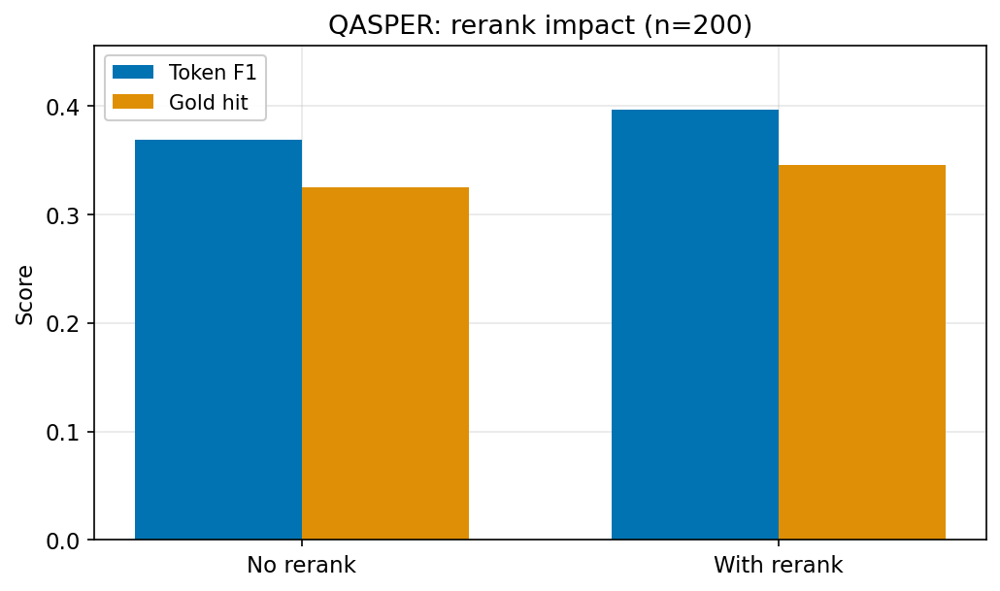
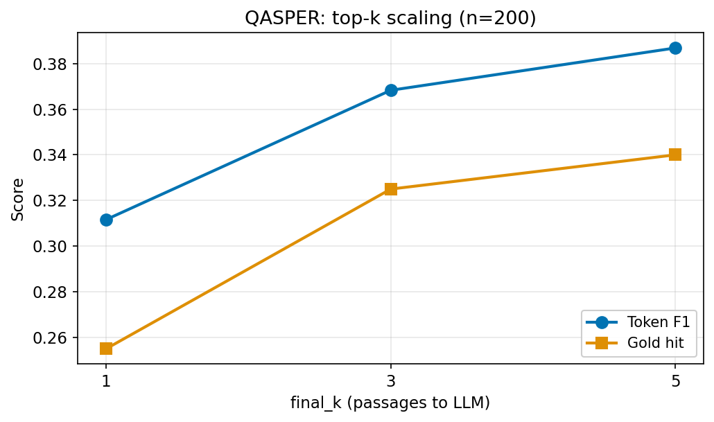
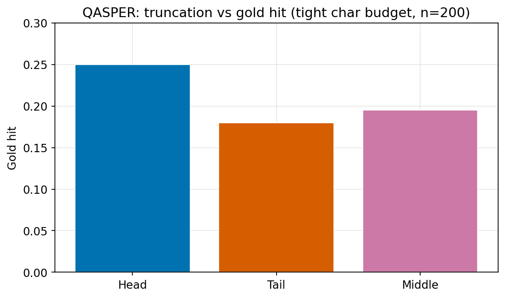

# RAG-Lab

Experiment framework for how retrieval affects RAG: modular pipeline, reproducible runs, saved CSVs/plots.

**Two tracks:** (1) **Benchmarks** — TREC-COVID (IR), TriviaQA RC (reading comprehension) — comparable numbers, rigorous ablations. (2) **Long-document / “product” QA** — [QASPER](https://arxiv.org/abs/2105.03011) (full NLP papers): chunking + retrieval over **multi-page text**, analogous to **PDF manuals, policy packs, internal doc libraries** (same code path as TriviaQA: `per_example_retrieval`).

## Project structure

```text
rag-lab
├── datasets/qa_dataset.jsonl
├── src/
│   ├── loader.py, chunker.py, embedder.py, retriever.py, reranker.py, metrics.py
│   ├── answer_metrics.py, context_truncation.py, prompts.py
│   ├── generator.py              # Gemini, OpenAI-compatible, Ollama, mock
│   ├── rag_generation.py, rag_pipeline.py, beir_io.py, faiss_cache.py
│   ├── error_analysis.py, triviaqa_hf.py, qasper_hf.py
├── data/trec-covid/              # optional BEIR download (see below)
├── experiments/
│   ├── exp_embedding.py, exp_chunk_size.py, exp_rerank.py
│   ├── exp_trec_covid.py
│   ├── exp_rag_generation.py           # custom QA JSONL
│   ├── exp_rag_generation_trec.py      # BEIR TREC-COVID corpus
│   ├── exp_rag_generation_triviaqa.py  # HF TriviaQA RC
│   └── exp_rag_generation_qasper.py    # HF QASPER (long papers)
├── analysis/                     # ERROR_ANALYSIS.md, TRACES_JSONL_FIELDS.md, optional JSONL / drafts
├── assets/                       # QASPER figures (from scripts/generate_charts.py)
├── scripts/                      # generate_charts.py, build_error_analysis_draft.py
├── tools/                        # export_triviaqa_traces.py, export_qasper_traces.py
└── results/                      # CSVs + *.png
```

## Experiments

| # | Script | What it measures |
|---|--------|------------------|
| 1 | `exp_embedding.py` | recall@k (custom QA JSONL) |
| 2 | `exp_chunk_size.py` | recall@k |
| 3 | `exp_rerank.py` | recall@k |
| 4 | `exp_trec_covid.py` | nDCG@10, P@10, MAP, R@100 (BEIR qrels) |
| 5 | `exp_rag_generation.py` | EM, token F1, gold_hit on custom QA; ablations: rerank, `final_k`, prompts, truncation (`head`/`tail`/`middle`). Default LLM **Gemini** (`GEMINI_API_KEY`). **Region blocked?** `--llm-backend ollama` ([Ollama](https://ollama.com), e.g. `ollama pull llama3.2`). Also `--llm-backend openai`, `docs/gemini-region-restriction.md`. **`--mock-generation`**: no API (wiring only). |
| 6 | `exp_rag_generation_trec.py` | Same ablations as (5) on FAISS over BEIR corpus; gold = `metadata.query` (keyword proxy). `--max-docs` / `--max-queries` for smoke tests. → `results/trec_rag_generation_results.csv` |
| 7 | `exp_rag_generation_triviaqa.py` | `mandarjoshi/trivia_qa` / `rc` (`datasets`); per-question retrieval over passages; EM/F1 vs aliases. → `results/triviaqa_rag_generation_results.csv` |
| 8 | `exp_rag_generation_qasper.py` | `allenai/qasper` (revision `refs/convert/parquet`): **full paper** as pool — long-document / PDF-like QA; gold = aliases from spans + evidence + yes/no (see `src/qasper_hf.py`). → `results/qasper_rag_generation_results.csv` |

First three: **recall@k**. TREC-COVID: **graded qrels** (`ir-measures`), BEIR-style reporting.

## Quickstart

```bash
python -m venv .venv && source .venv/bin/activate   # Windows: .venv\Scripts\activate
pip install -r requirements.txt
cp .env.example .env   # GEMINI_API_KEY, OPENAI_*, OLLAMA_BASE_URL — optional
```

```bash
python experiments/exp_embedding.py
python experiments/exp_chunk_size.py
python experiments/exp_rerank.py
```

**RAG (needs LLM or Ollama or `--mock-generation`):**

```bash
python experiments/exp_rag_generation.py --mode all
# ollama pull llama3.2 && python experiments/exp_rag_generation.py --mode all --llm-backend ollama
```

Modes: `compare-rerank`, `compare-topk`, `compare-prompts`, `compare-truncation`, `all` → `results/rag_generation_results.csv`.

```bash
python experiments/exp_rag_generation_trec.py --data-dir data/trec-covid --mode all --llm-backend ollama
python experiments/exp_rag_generation_triviaqa.py --split validation --max-examples 200 --mode all --llm-backend ollama
python experiments/exp_rag_generation_qasper.py --split validation --max-examples 200 --mode all --llm-backend ollama   # long docs; GPU-friendly
```

`.env` is loaded from project root (`python-dotenv`). Do not commit `.env`.

## TREC-COVID (BEIR)

1. Download [trec-covid.zip](https://public.ukp.informatik.tu-darmstadt.de/thakur/BEIR/datasets/trec-covid.zip) (large).
2. Folder needs `corpus.jsonl`, `queries.jsonl`, `qrels/test.tsv`.
3. Run:

```bash
python experiments/exp_trec_covid.py --data-dir data/trec-covid --device mps
python experiments/exp_trec_covid.py --data-dir data/trec-covid --mode compare-embeddings
python experiments/exp_trec_covid.py --data-dir data/trec-covid --mode compare-chunks --embedding-model BAAI/bge-base-en-v1.5
python experiments/exp_trec_covid.py --data-dir data/trec-covid --mode compare-rerank --first-stage-k 100
python experiments/exp_trec_covid.py --data-dir data/trec-covid --mode compare-all   # long
```

Flags: `--embedding-model(s)`, `--chunk-sizes`, `--chunk-search-k`, `--rerank-model`, `--retrieve-k` (≥100 for R@100), `--max-queries` / `--max-docs` (debug only).

**Cache:** `<data-dir>/.rag_lab_cache/` (override `--cache-dir`); same corpus + embedding + chunk settings reuse FAISS. `--no-cache` rebuilds.

Outputs: `results/trec_covid_beir_results.csv` (`--mode single`); comparison CSVs as above. Column **AP** = MAP.

Background: [NIST TREC-COVID](https://ir.nist.gov/covidSubmit/index.html).

## Results (TREC-COVID, BEIR)

Setup: full BEIR corpus + qrels; FAISS `IndexFlatIP`, normalized embeddings; **`retrieve_k` = 100**. Chunks: index → max-pool to doc ids. Rerank: bi-encoder top-100 → **BGE-reranker-base**; R@100 unchanged if only reordering inside pool.

### Embedding models (`compare-embeddings`)

| Model | P@10 | nDCG@10 | R@100 | AP (MAP) |
|-------|------|---------|-------|----------|
| intfloat/e5-small-v2 | **0.784** | **0.744** | **0.136** | **0.105** |
| BAAI/bge-base-en-v1.5 | 0.730 | 0.672 | 0.133 | 0.096 |
| BAAI/bge-small-en-v1.5 | 0.708 | 0.666 | 0.123 | 0.087 |

### Chunk sizes (`compare-chunks`, BGE-base)

| chunk_size | P@10 | nDCG@10 | R@100 | AP |
|------------|------|---------|-------|-----|
| 256 | **0.738** | **0.682** | **0.133** | **0.097** |
| 512 | 0.730 | 0.672 | 0.133 | 0.096 |
| 1024 | 0.730 | 0.672 | 0.133 | 0.096 |

### Reranking (`compare-rerank`, BGE-base)

| Setting | P@10 | nDCG@10 | R@100 | AP |
|---------|------|---------|-------|-----|
| Bi-encoder only | 0.730 | 0.672 | 0.133 | 0.096 |
| + BGE-reranker-base | **0.818** | **0.762** | 0.133 | **0.102** |

**Summary:** E5-small best among three bi-encoders; chunk **256** slightly edges 512/1024 for BGE-base; rerank lifts P@10/nDCG@10, not R@100 in a fixed top-100 pool.

Raw CSVs: `results/trec_covid_compare_embeddings.csv`, `trec_covid_compare_chunks.csv`, `trec_covid_compare_rerank.csv`.

## Results (TriviaQA RC, RAG generation)

**Run:** GPU server, Ollama `llama3.2`, `BAAI/bge-base-en-v1.5`, `BAAI/bge-reranker-base`, `validation`, `--max-examples 200`, `--mode all`. **Metrics:** EM, token F1 (best alias), gold_hit. Server copy: `RAG_Lab_results_from_server/triviaqa_rag_generation_results.csv`.

### Reranking

| Setting | EM | Token F1 | Gold hit |
|---------|-----|----------|----------|
| No rerank | 0.455 | 0.592 | 0.715 |
| + BGE reranker | **0.475** | **0.613** | **0.730** |

### Top-k

| final_k | EM | Token F1 | Gold hit |
|---------|-----|----------|----------|
| 1 | 0.430 | 0.587 | 0.705 |
| 3 | 0.455 | 0.592 | 0.715 |
| 5 | 0.455 | 0.592 | 0.715 |

### Prompts

| Template | EM | Token F1 | Gold hit |
|----------|-----|----------|----------|
| default | 0.455 | 0.592 | 0.715 |
| bullets | **0.520** | **0.632** | 0.695 |
| strict_cite | 0.430 | 0.538 | 0.660 |

### Truncation (`--truncation-chars` 1200)

| Strategy | EM | Token F1 | Gold hit |
|----------|-----|----------|----------|
| head | **0.420** | **0.545** | **0.635** |
| tail | 0.310 | 0.406 | 0.470 |
| middle | 0.295 | 0.396 | 0.475 |

**Summary (n=200):** Rerank + **bullets** help; **strict_cite** and **tail/middle** truncation hurt under tight budget; **final_k ≥ 3** plateaus vs 5.

### QASPER (long-document QA, n=200)

**Setup:** GPU server, Ollama `llama3.2`, `BAAI/bge-base-en-v1.5`, `BAAI/bge-reranker-base`, `validation`, `--max-examples 200`, `--mode all`. Papers are **10k–30k+ characters** each; defaults use `--chunk-size 384` and `--max-context-chars 8000`. Raw CSV: `results/qasper_rag_generation_results.csv`. Regenerate figures after updating the CSV:

```bash
python scripts/generate_charts.py
```







**Key findings (n=200):** Rerank ↑ F1 / gold hit / EM; **k=5 > k=3 > k=1** on F1 and gold hit; **bullets** best EM; **strict_cite** ↓ gold hit; **head > tail > middle** under truncation (same pattern as TriviaQA).

**Limitations (QASPER):** n=200; **EM** is a harsh metric on long/paraphrased aliases (prefer **F1** / **gold_hit**); gold labels follow `qasper_hf.py` heuristics, not the official leaderboard; truncation rows use a **tight char budget**—do not compare to non-truncation baselines.

### Traces & error taxonomy

Taxonomy: **retrieval** (no gold-bearing chunk in top-`retrieve_k`), **ranking** (gold in pool but not in top-`final_k`), **generation** (gold in final context but not exact match). Full definitions: `analysis/ERROR_ANALYSIS.md`.

**What exported JSONL is for**

- **`--skip-generation`:** labels **pool vs final** (`retrieval_stage` only). Use this to see whether gold is retrievable without LLM cost.
- **Real LLM** (omit `--skip-generation`, no `--mock-generation`): `prediction`, F1/gold_hit, and **`failure_bucket`** are meaningful for case studies.
- **`--mock-generation`:** wiring tests only; `prediction` is a stub → **do not** interpret metrics or treat **`generation`** as “model failure” (it mostly means **EM ≠ 1** when gold is already in context).

```bash
python tools/export_triviaqa_traces.py --out analysis/triviaqa_traces.jsonl --max-examples 100 --skip-generation   # retrieval labels only
python tools/export_qasper_traces.py --out analysis/qasper_traces.jsonl --max-examples 60 --llm-backend ollama      # real answers + buckets
python scripts/build_error_analysis_draft.py --in analysis/qasper_traces.jsonl --out analysis/error_analysis_draft.md
```

Fields: `analysis/TRACES_JSONL_FIELDS.md`. Example TriviaQA rows (LLM run): `tc_33` / `tc_49` success; `tc_40` ranking; `tc_455` / `tc_241` generation.

## Metrics

Custom QA: **recall@k**. TREC-COVID: qrels-based IR (see scripts). RAG: **EM** / **token F1** (normalized); **gold_hit** = any alias substring in the output. Optional LLM judge later.

## Notes

`sentence-transformers` models are swappable. TREC: full corpus + qrels for comparable runs; use `--max-docs` only for smoke tests.
