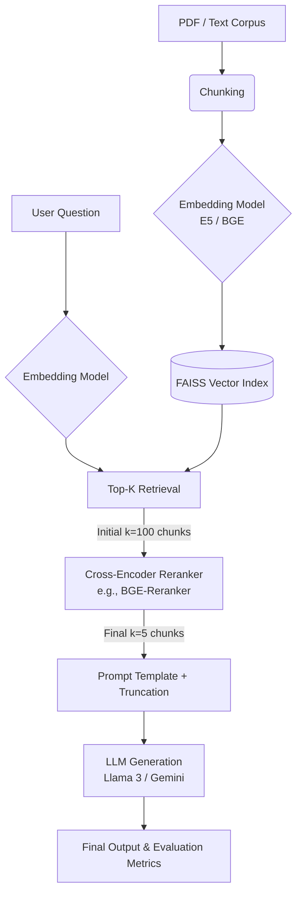

# RAG-Lab

How **retrieval** choices affect **RAG**: one modular pipeline, benchmarks, CSVs/plots.

**Tracks:** (1) **IR / RC benchmarks** — TREC-COVID, TriviaQA RC. (2) **Long docs** — [QASPER](https://arxiv.org/abs/2105.03011) (full papers → PDF/manual-like QA; same retrieval path as TriviaQA with `per_example_retrieval`).

## Layout

```text
rag-lab
├── datasets/qa_dataset.jsonl
├── demo/app.py                 # Streamlit: session RAG, MinIO ingest, query saved jobs
├── docker-compose.yml          # AiStor image (quay.io/…/aistor) + Redis — `docker compose up -d`
├── src/                        # loader, chunker, embedder, retriever, hybrid_retrieval (BM25+RRF),
│                               # reranker, metrics, generator, rag_pipeline, rag_generation,
│                               # document_ingest_pipeline, storage/ (MinIO, Redis), …
├── data/trec-covid/            # optional BEIR
├── experiments/                # exp_embedding, exp_chunk_size, exp_rerank, exp_trec_covid,
│                               # exp_rag_generation*.py, exp_qasper_hybrid_compare.py
├── analysis/  assets/  scripts/  tools/  results/
```

## Architecture



### Production RAG blueprint (quality + latency)

Use this as a practical target operating model when moving from experiments to production traffic.

| Stage | Default target | Why it helps |
|---|---|---|
| Retrieval | Strong embedding model + optional hybrid BM25 fusion | Dense retrieval captures semantics; sparse retrieval catches exact terms/acronyms |
| Candidate pool | `vdb_top_k = 50-100` | Broad first pass improves recall before expensive filtering |
| Rerank | Cross-encoder, `reranker_top_k = 3-5` | Improves precision of final context sent to generation |
| Query rewrite | Conditional only (fallback path) | Avoids extra LLM latency unless first-pass retrieval is weak |
| Generation | Strict grounding + explicit source citations | Reduces hallucinations and improves answer trust |
| UX latency | Stream tokens immediately | Improves time-to-first-token and perceived responsiveness |
| Scale | Shard/vector-service split when corpus is large | Keeps p95 retrieval latency stable as chunk count grows |
| Cost control | Semantic cache for repeated questions | Skips repeated retrieval/generation for hot intents |

### RAG hardening checklist

Use this checklist to evolve the current lab pipeline without breaking experiment reproducibility.

- [ ] **Retrieval quality baseline:** run `exp_trec_covid.py` and `exp_qasper_hybrid_compare.py` to set recall/IR baselines before changing models.
- [ ] **Two-stage retrieval bounds:** keep broad retrieval (`retrieve_k`) and narrow final context (`final_k`) explicit in all generation experiments.
- [ ] **Hybrid retrieval gate:** enable BM25+RRF for datasets where entities/tables/numeric strings are common; keep dense-only as control.
- [ ] **Conditional rewrite policy:** add a fallback rewrite/decomposition step only when first-pass retrieval confidence is below threshold.
- [ ] **Citation-first prompting:** prefer strict cite templates for high-stakes QA; track any EM/F1 trade-off against faithfulness gains.
- [ ] **Streaming output path:** enable token streaming in interactive surfaces (e.g., demo app) to reduce perceived latency.
- [ ] **Per-stage latency telemetry:** log timers for embed, retrieve, rerank, prompt-build, generation; report p50/p95 by run.
- [ ] **Grounding eval cadence:** run RAGAS (`exp_ragas_eval.py`, `exp_ragas_financebench.py`) on a fixed sample each change window.
- [ ] **Reliability guardrails:** define an error budget (example: 99% queries under 2s in chosen environment) and pause feature work when violated.
- [ ] **Scale migration trigger:** when in-memory FAISS no longer meets latency/throughput targets, move retrieval to a managed/sharded vector backend while preserving chunking/eval harness.

### Hybrid retrieval (BM25 + dense)

For long documents, **dense-only** FAISS search can miss chunks that match lexically (tables, numbers, rare tokens). Optional **hybrid** retrieval builds a **BM25** index over the same chunks and merges dense + sparse rankings with **Reciprocal Rank Fusion (RRF)** (`src/hybrid_retrieval.py`, dependency `rank-bm25`).

- **Pipeline:** `retrieve_passages_pool_and_final(..., bm25_resources=...)` or set `RAGGenerationConfig(use_hybrid=True)` when `per_example_retrieval=True` (QASPER / TriviaQA RC style).
- **`fusion_list_k`:** how many candidates each retriever contributes before RRF; default `None` uses the full chunk list for that document (capped by corpus size). Larger lists help when gold is mid-ranked on one side only.
- **Sanity check (no dataset):** `python tools/test_hybrid_retrieval_example.py --fusion-list-k 6`
- **QASPER benchmark:** `python experiments/exp_qasper_hybrid_compare.py --mode retrieval --max-examples 200` → writes `results/qasper_dense_hybrid_retrieval_*.csv`.

## Quickstart

```bash
python -m venv .venv && source .venv/bin/activate   # Windows: .venv\Scripts\activate
pip install -r requirements.txt
cp .env.example .env    # optional: GEMINI_API_KEY, OPENAI_*, OLLAMA_BASE_URL, MINIO_*, REDIS_URL
```

### Streamlit demo (`demo/app.py`)

Three sidebar views: **Ingest** (run pipeline → MinIO + Redis), **Query** (RAG over a loaded corpus), **Library** (list jobs from MinIO metadata).

```bash
.venv/bin/streamlit run demo/app.py
```

Use the **project venv** so `sentence_transformers` / `torch` match. `.streamlit/config.toml` disables file-watching to reduce Hugging Face `transformers` log noise; refresh the browser after code edits.

**Milvus + Redis in Query mode (new):**
- In **Query → Options**, set **Vector DB backend = `milvus`**.
- Click **Sync loaded job to Milvus** once after loading a job.
- Enable **Redis semantic cache** to reuse answers for semantically similar questions.
- Configure with `.env`: `MILVUS_URI`, `MILVUS_TOKEN` (optional), `MILVUS_COLLECTION`, `REDIS_URL`.

**Session vs persisted index:** RAG state (FAISS + chunks) lives **in process memory** while Streamlit runs. To reuse a corpus across restarts, run **Ingest** once, then in **Query** attach a **`job_id`** and **Load** so chunks and `faiss.index` are pulled from MinIO again.

### Document ingest (MinIO + Redis)

Stack (optional, for **Ingest** / **Library** / loading jobs in **Query**):

```bash
docker compose up -d    # object store API :9000, console :9001, Redis :6379
```

Copy `.env.example` → `.env` and set **`MINIO_*`** (endpoint is `host:port` only) and **`REDIS_URL`** if not using defaults. The Compose file uses the **AiStor**-published MinIO image (`quay.io/minio/aistor/minio:latest`) plus **Redis 7**; see comments in `docker-compose.yml` for TLS and port conflicts.

**Pipeline (implementation: `src/document_ingest_pipeline.py`):**

1. **Extract** — PDF via pypdf (optional page filter `1,3,5-7`); text/Markdown as UTF-8.
2. **Chunk** — whitespace token windows (`chunk_size` / `chunk_overlap` in `src/chunker.py`).
3. **Summarize (optional)** — strategies `single` | `hierarchical` | `iterative`; LLM or stub.
4. **Embed + FAISS** — SentenceTransformers → `IndexFlatIP` (normalized vectors), serialized with `src/retriever.py`.
5. **Store** — objects under `{job_id}/` in the bucket; **Redis** key `ingest:job:{id}` tracks stage (`queued` … `completed` / `failed`).

**Artifacts in MinIO (prefix `{job_id}/`):**

| Object | Role |
|--------|------|
| `source.bin` | Original upload |
| `extracted_text.json` | Filename, size, short preview |
| `chunks.json` | Chunk texts (+ optional per-chunk summaries) |
| `faiss.index` | Serialized FAISS index bytes |
| `metadata.json` | Job metadata (model, chunk params, `n_chunks`, `index_dim`, …) |
| `summary.json` | Present for iterative global summary only |

**Query-time load:** `load_ingest_from_minio` downloads `chunks.json` + `faiss.index` and deserializes FAISS **in RAM**. MinIO is **object storage**, not a queryable vector database.

**Batch experiments:**

```bash
python experiments/exp_embedding.py
python experiments/exp_chunk_size.py
python experiments/exp_rerank.py
```

**RAG generation** (needs LLM, Ollama, or `--mock-generation`):

```bash
python experiments/exp_rag_generation.py --mode all
# ollama pull llama3.2 && python experiments/exp_rag_generation.py --mode all --llm-backend ollama

# RAGAS evaluation (install first: pip install ragas datasets)
python experiments/exp_ragas_eval.py --data-path datasets/qa_dataset.jsonl --max-examples 100 --llm-backend ollama
# FinanceBench + RAGAS (clone first: https://github.com/patronus-ai/financebench)
python experiments/exp_ragas_financebench.py --financebench-root data/financebench --max-examples 100 --llm-backend ollama
# Gemini evaluator (install: pip install langchain-google-genai, set GEMINI_API_KEY)
# python experiments/exp_ragas_financebench.py --financebench-root data/financebench --max-examples 30 --llm-backend gemini --llm-model gemini-2.5-flash --ragas-eval-model gemini-2.5-flash
```

Modes → `results/rag_generation_results.csv`: `compare-rerank`, `compare-topk`, `compare-prompts`, `compare-truncation`, `all`.

```bash
python experiments/exp_rag_generation_trec.py --data-dir data/trec-covid --mode all --llm-backend ollama
python experiments/exp_rag_generation_triviaqa.py --split validation --max-examples 200 --mode all --llm-backend ollama
python experiments/exp_rag_generation_qasper.py --split validation --max-examples 200 --mode all --llm-backend ollama
# FinanceBench open-source (clone patronus-ai/financebench first)
# git clone https://github.com/patronus-ai/financebench data/financebench
python experiments/exp_rag_generation_financebench.py --financebench-root data/financebench --mode all --llm-backend ollama --max-examples 100

# QASPER: dense FAISS vs BM25+dense (RRF) — retrieval oracle (gold alias in chunks), no LLM by default
python experiments/exp_qasper_hybrid_compare.py --mode retrieval --max-examples 200
# End-to-end EM/F1/gold_hit vs same with hybrid (needs LLM or --mock-generation)
# python experiments/exp_qasper_hybrid_compare.py --mode generation --max-examples 50 --mock-generation
```

`.env` loads from repo root (`python-dotenv`); do not commit `.env`.

## Experiments (summary)

| # | Script | Measures |
|---|--------|----------|
| 1–3 | `exp_embedding.py`, `exp_chunk_size.py`, `exp_rerank.py` | recall@k (custom QA JSONL) |
| 4 | `exp_trec_covid.py` | nDCG@10, P@10, MAP, R@100 (BEIR qrels) |
| 5 | `exp_rag_generation.py` | EM, F1, gold_hit; ablations: rerank, `final_k`, prompts, truncation. Default **Gemini**; **`--llm-backend ollama` / `openai`**; region issues → `docs/gemini-region-restriction.md`; **`--mock-generation`** = no API |
| 6–8 | `exp_rag_generation_trec.py`, `_triviaqa.py`, `_qasper.py` | Same style on TREC corpus / TriviaQA RC / QASPER (long papers). Outputs under `results/` |
| 9 | `exp_qasper_hybrid_compare.py` | QASPER **dense vs hybrid** (BM25+RRF): oracle gold substring in `retrieve_k` pool / `final_k` slice; optional `--mode generation` |

## TREC-COVID (BEIR)

1. Download [trec-covid.zip](https://public.ukp.informatik.tu-darmstadt.de/thakur/BEIR/datasets/trec-covid.zip) → `corpus.jsonl`, `queries.jsonl`, `qrels/test.tsv` under `data/trec-covid/`.

```bash
python experiments/exp_trec_covid.py --data-dir data/trec-covid --device mps
python experiments/exp_trec_covid.py --data-dir data/trec-covid --mode compare-embeddings
python experiments/exp_trec_covid.py --data-dir data/trec-covid --mode compare-all   # long
```

Flags: `--embedding-model(s)`, `--chunk-sizes`, `--chunk-search-k`, `--rerank-model`, `--retrieve-k` (≥100 for R@100), `--max-queries` / `--max-docs` (smoke only). **Cache:** `<data-dir>/.rag_lab_cache/` (`--cache-dir`, `--no-cache`). Outputs: `results/trec_covid_*.csv`; **AP** = MAP. [NIST background](https://ir.nist.gov/covidSubmit/index.html).

## Results (TREC-COVID)

Setup: full corpus + qrels; FAISS `IndexFlatIP`, normalized embeddings; `retrieve_k` = 100; rerank = bi-encoder top-100 → **BGE-reranker-base** (reorders inside pool; R@100 unchanged).

**Embeddings (`compare-embeddings`)**

| Model | P@10 | nDCG@10 | R@100 | AP |
|-------|------|---------|-------|-----|
| intfloat/e5-small-v2 | **0.784** | **0.744** | **0.136** | **0.105** |
| BAAI/bge-base-en-v1.5 | 0.730 | 0.672 | 0.133 | 0.096 |
| BAAI/bge-small-en-v1.5 | 0.708 | 0.666 | 0.123 | 0.087 |

**Chunks (`compare-chunks`, BGE-base)** — 256 slightly best; 512/1024 tie.

**Rerank (`compare-rerank`)** — +rerank: P@10 **0.818**, nDCG@10 **0.762** vs bi-encoder-only 0.730 / 0.672.

Raw: `results/trec_covid_compare_embeddings.csv`, `*_chunks.csv`, `*_rerank.csv`.

## Results (TriviaQA RAG, n=200)

Ollama `llama3.2`, BGE + reranker, `validation`, `--mode all`. **Rerank** ↑ EM/F1/gold_hit. **Prompts:** `bullets` best F1. **Truncation** (1200 chars): **head** ≫ tail/middle. **final_k** 3 ≈ 5 > 1. Server CSV copy may live under `RAG_Lab_results_from_server/triviaqa_rag_generation_results.csv`.

## Results (QASPER, n=200)

Long document QA evaluation. Metrics focus on Token F1 and Gold Hit (whether the answer contains the exact gold alias).

**Retrieval oracle (dense vs hybrid, validation, n=200)** — no LLM; **gold hit** = any answer alias appears as a substring in a retrieved chunk (`--retrieve-k 10`, `--final-k 3`, no rerank, BGE-base, chunk 384/48). Slight gains from BM25+RRF on pool and top-`final_k` slices; see `results/qasper_dense_hybrid_retrieval_summary.csv`.

| Setting | Gold in top-10 pool | Gold in first 3 chunks |
|---------|----------------------|-------------------------|
| Dense (FAISS) | 94.5% | 73.5% |
| Hybrid (BM25 + RRF) | 95.5% | 75.5% |

**End-to-end RAG** (table below): LLM + rerank / prompts / truncation ablations.

| Experiment | Setting | Exact Match | Token F1 | Gold Hit |
|------------|---------|-------------|----------|----------|
| **Reranker** | No Rerank | 0.015 | 0.368 | 0.325 |
| | With Rerank | **0.035** | **0.396** | **0.345** |
| **Top-K** | k=1 | 0.025 | 0.311 | 0.255 |
| | k=3 | 0.015 | 0.368 | 0.325 |
| | k=5 | **0.030** | **0.386** | **0.340** |
| **Prompt** | Default | 0.015 | **0.368** | 0.325 |
| | Bullets | **0.050** | 0.367 | **0.330** |
| | Strict Cite | 0.015 | 0.354 | 0.285 |
| **Truncation**| Head | **0.030** | **0.314** | **0.250** |
| | Tail | 0.030 | 0.265 | 0.180 |
| | Middle | 0.025 | 0.252 | 0.195 |

**Key Findings**
1. **Reranking is Crucial for Long Docs:** Adding a Cross-Encoder reranker increased Token F1 from 0.368 to 0.396 and improved the gold hit rate by 2%.
2. **Context Volume vs. Noise:** Increasing the final context window to `k=5` yielded the best F1 scores (0.386). The model successfully navigated the extra context without hallucinating heavily.
3. **Prompt Engineering:** Asking the LLM to output in "bullets" slightly improved exact match and gold hit metrics, though F1 remained comparable.
4. **Context Truncation:** When hitting strict context limits, keeping the `head` (start) of the retrieved chunks vastly outperformed keeping the `tail` or `middle`.

**Limitations**
- **Exact Match (EM) is Harsh:** EM scores are very low (3-5%) because QASPER answers are often long aliases or phrases, and LLMs rarely generate the *exact* string without surrounding conversational text. Token F1 and Gold Hit are better signals here.
- **Indexing model:** The demo still **searches in memory** after loading; MinIO persists **artifacts**, not live ANN serving. For managed low-latency vector search at scale, you would add a vector database or hosted retrieval service—MinIO here is durable blob storage for ingest outputs.

Long papers (10k–30k+ chars); defaults e.g. `--chunk-size 384`, `--max-context-chars 8000`. **Rerank** helps; **k=5 > k=3 > k=1** on F1/gold hit; **bullets** best EM; **strict_cite** lowers gold hit; **head > tail > middle** under truncation. Figures: `python scripts/generate_charts.py` → `assets/qasper_*.png`. CSV: `results/qasper_rag_generation_results.csv`.

**Caveats:** EM is harsh on long aliases (prefer F1 / gold_hit); gold heuristics in `qasper_hf.py`; truncation rows use a **tight budget**—not comparable to non-truncation runs.

## Traces & errors

Qualitative QASPER success/failure writeup: `analysis/ERROR_ANALYSIS.md`. Export schema and field meanings: `analysis/TRACES_JSONL_FIELDS.md`. Failure **taxonomy** (retrieval vs ranking vs generation) is described there and in exported JSONL traces.

- `--skip-generation`: pool vs final labels only (no LLM cost).
- Real LLM: `prediction`, F1, `failure_bucket` for case studies.
- `--mock-generation`: stub only; do not interpret “generation” failures literally.

```bash
python tools/export_triviaqa_traces.py --out analysis/triviaqa_traces.jsonl --max-examples 100 --skip-generation
python tools/export_qasper_traces.py --out analysis/qasper_traces.jsonl --max-examples 60 --llm-backend ollama
python scripts/build_error_analysis_draft.py --in analysis/qasper_traces.jsonl --out analysis/error_analysis_draft.md
```

## Metrics & notes

Custom QA: **recall@k**. TREC: qrels IR metrics. RAG: **EM**, **token F1**, **gold_hit** (alias substring in output).

Models are swappable (`sentence-transformers`). TREC: use full corpus + qrels; `--max-docs` is for smoke tests only.
