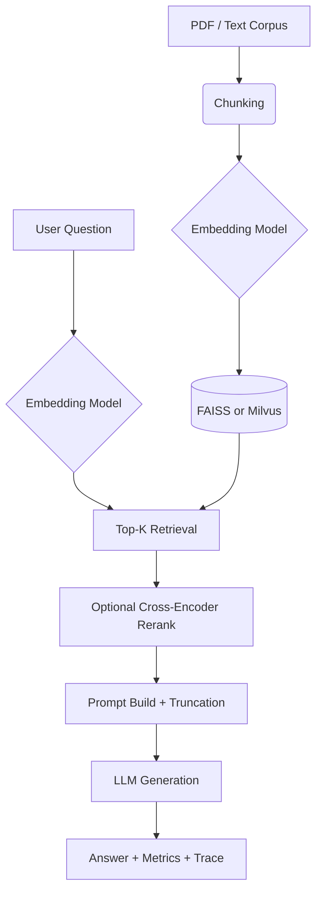

# Architecture

## High-level flow

## Core components

- `src/ingestion/`: document ingest (extract, chunk, embed, MinIO/Milvus artifacts)
- `src/rag/`: retrieval helpers, generation evaluation loop, context truncation
- `src/retrieval/`: FAISS/Milvus search, hybrid BM25 fusion, chunk metadata filters
- `src/llm/`: embedder, reranker, generators, prompt templates
- `src/datasets/`: QA / BEIR / HF dataset loaders
- `src/eval/`: answer metrics, RAGAS UI helpers, experiment tracking
- `src/config/`: YAML defaults (OmegaConf) and `QueryRequest` → pipeline config mapping
- `src/storage/`: MinIO artifacts, Redis semantic cache, Redis job status, Milvus vector store
- `demo/app.py`: interactive UI, experiment logging, benchmark dashboard
- `src/api/server.py`: production API path for concurrent RAG traffic

## Retrieval strategy

- Dense retrieval via embedding similarity
- Optional hybrid retrieval: BM25 + dense fused with RRF
- Optional rerank stage for final context quality

Recommended production defaults:
- retrieve broad (`retrieve_k=50-100`)
- rerank and compress to `final_k=3-5`
- enforce strict grounding prompt

## Caching strategy

- L1 process cache (API): TTL+LRU
- L2 semantic cache (Redis): embedding similarity lookup
- Optional retrieval reuse in API flow via cache key normalization

## Persistence model

- MinIO stores immutable ingest artifacts (`chunks.json`, `faiss.index`, metadata)
- Redis stores ingest progress and semantic cache entries
- SQLite (`results/experiment_db.sqlite`) stores experiment/query telemetry
- Milvus stores searchable vectors for service-style retrieval

